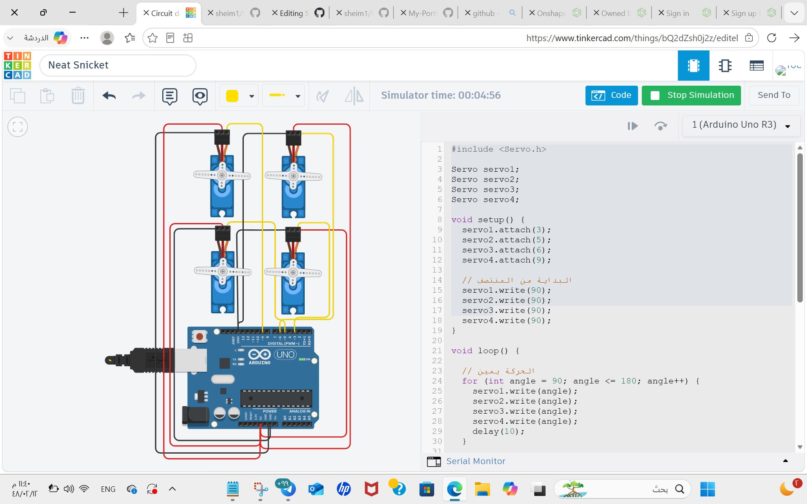

# 4 Servo Motors Sweep Project

## Project Description

This project demonstrates how to control four Servo Motors using an Arduino Uno in Tinkercad Circuits.

The four Servo Motors perform a Sweep movement from side to side for two seconds. After two seconds, all Servo Motors stop and remain fixed at a 90-degree angle.

## Components

- Arduino Uno R3
- 4 Servo Motors
- Jumper Wires

## Servo Motor Connections

| Servo Motor | Signal Pin |
|---|---|
| Servo 1 | Pin 3 |
| Servo 2 | Pin 5 |
| Servo 3 | Pin 6 |
| Servo 4 | Pin 9 |

All Servo Motors are connected to the Arduino 5V and GND.

## Circuit and Arduino Code

The circuit and Arduino code were designed and tested using Tinkercad Circuits.

## How It Works

1. The four Servo Motors start moving together.
2. The motors perform a Sweep movement from side to side.
3. The movement lasts for two seconds.
4. After two seconds, all motors stop.
5. All four Servo Motors are fixed at a 90-degree angle.

## Simulation

The project was tested and simulated using Tinkercad Circuits. The simulation video demonstrates the movement of the four Servo Motors and their final position at 90 degrees.

## Author

Shaimaa
